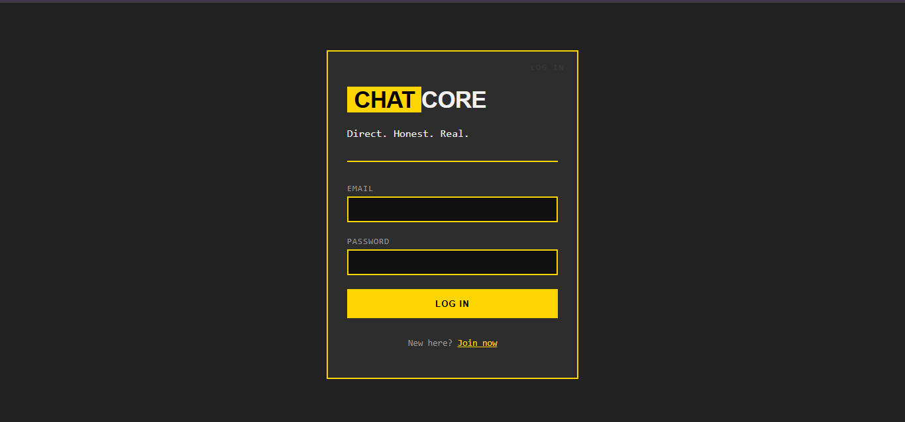
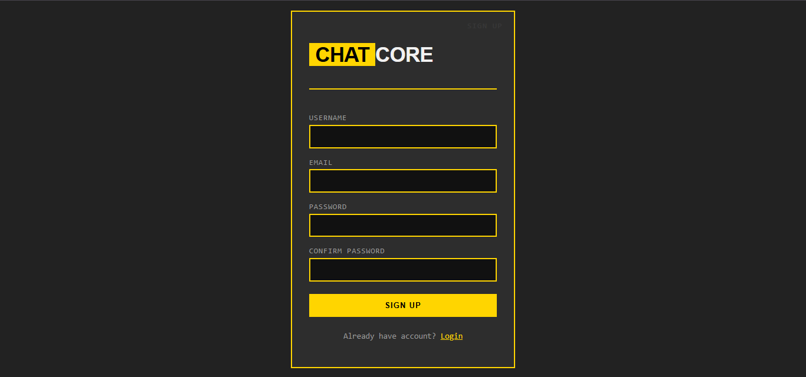
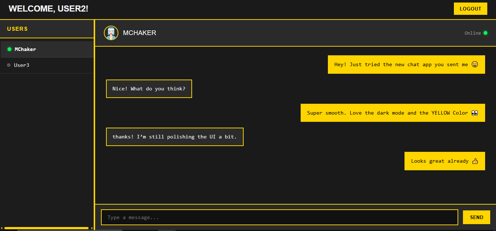

# 💬 Real-Time Chat Application

A full-stack real-time chat application built with the MERN stack and Socket.io, featuring instant messaging, online status tracking, and user authentication.

## ✨ Features

### Core Functionality
- 🔐 **User Authentication** - Secure JWT-based authentication with bcrypt password hashing
- 💬 **Real-Time Messaging** - Instant message delivery using Socket.io WebSocket connections
- 👥 **User Management** - Browse list of registered users and start conversations
- 🟢 **Live Status Indicators** - Real-time online/offline status updates
- 📜 **Message History** - Persistent message storage with conversation history
- 🔄 **Optimistic UI Updates** - Instant message display for smooth user experience

### Technical Features
- Protected routes with JWT authentication
- Real-time WebSocket connection management
- Responsive design for various screen sizes
- Session persistence with localStorage
- Error handling and validation

## 🖼️ Screenshots

### Authentication
  
  

### Chat Interface 
  

## 🛠️ Tech Stack

### Frontend
- **React** - UI library for building interactive interfaces
- **React Router** - Client-side routing
- **Socket.io Client** - WebSocket client for real-time communication
- **Axios** - HTTP client for API requests
- **Context API** - Global state management

### Backend
- **Node.js** - JavaScript runtime
- **Express** - Web application framework
- **Socket.io** - Real-time bidirectional event-based communication
- **MongoDB** - NoSQL database for data persistence
- **Mongoose** - MongoDB object modeling
- **JWT** - JSON Web Tokens for authentication
- **bcryptjs** - Password hashing

## 📋 Prerequisites

Before running this project, make sure you have:

- **Node.js** (v14 or higher)
- **MongoDB** (local installation or MongoDB Atlas account)
- **npm** or **yarn**

## 🚀 Installation & Setup

### 1. Clone the repository
```bash
git clone https://github.com/MChaker01/real-time-chat-app.git
cd real-time-chat-app
```

### 2. Backend Setup
```bash
cd backend
npm install
```

Create a `.env` file in the backend directory:
```env
PORT=3000
DB_URI=your_mongodb_connection_string
JWT_SECRET=your_jwt_secret_key
```

Start the backend server:
```bash
npm run dev
```

### 3. Frontend Setup
```bash
cd ../frontend
npm install
```

Start the frontend development server:
```bash
npm run dev
```

The application will be available at `http://localhost:5173`

## 📚 API Endpoints

### Authentication
```
POST /api/auth/register - Register a new user
POST /api/auth/login    - Login and receive JWT token
```

### Users
```
GET /api/users - Get list of all users (Protected)
```

### Messages
```
GET /api/messages/:userId - Get conversation history with a specific user (Protected)
```

### Socket.io Events

**Client → Server:**
- `send_message` - Send a message to another user

**Server → Client:**
- `receive_message` - Receive a new message
- `user_status` - User online/offline status change
- `online_users_list` - List of currently online users

## 🏗️ Project Structure

```
real-time-chat-app/
├── backend/
│   ├── controllers/
│   │   ├── authController.js
│   │   ├── messageController.js
│   │   └── userController.js
│   ├── middleware/
│   │   ├── authMiddleware.js
│   │   └── socketAuth.js
│   ├── models/
│   │   ├── User.js
│   │   └── Message.js
│   ├── routes/
│   │   ├── authRoutes.js
│   │   ├── messageRoutes.js
│   │   └── userRoutes.js
│   ├── sockets/
│   │   └── chatSocket.js
│   └── server.js
├── frontend/
│   ├── src/
│   │   ├── components/
│   │   │   ├── ChatPanel.jsx
│   │   │   ├── MessageInput.jsx
│   │   │   ├── UsersList.jsx
│   │   │   └── Spinner.jsx
│   │   ├── context/
│   │   │   ├── AuthContext.jsx
│   │   │   └── SocketContext.jsx
│   │   ├── pages/
│   │   │   ├── Login.jsx
│   │   │   ├── Register.jsx
│   │   │   └── Chat.jsx
│   │   ├── services/
│   │   │   └── api.js
│   │   └── App.jsx
│   └── package.json
└── README.md
```

## 🔐 Authentication Flow

1. User registers with username, email, and password
2. Password is hashed using bcrypt before storage
3. Upon login, server generates a JWT token
4. Token is stored in localStorage and sent with protected requests
5. Socket.io connection authenticates using the same JWT token

## 🌐 Real-Time Communication Flow

1. User logs in → WebSocket connection established with JWT authentication
2. Server tracks online users in a Map data structure
3. User sends message → Backend saves to MongoDB and emits to receiver's socket
4. Receiver gets instant notification via Socket.io event
5. Online/offline status updates broadcast to all connected users

## 🎯 Key Learning Outcomes

This project demonstrates proficiency in:

- Full-stack JavaScript development
- RESTful API design and implementation
- Real-time bidirectional communication with WebSockets
- JWT-based authentication and authorization
- MongoDB database design and relationships
- React Context API for state management
- Component composition and props management
- Asynchronous JavaScript and Promise handling

## 🚧 Future Enhancements

- [ ] Typing indicators ("User is typing...")
- [ ] Message read receipts
- [ ] Profile image upload functionality
- [ ] Group chat support
- [ ] Message search and filtering
- [ ] Emoji picker
- [ ] File sharing
- [ ] Push notifications
- [ ] Message editing and deletion
- [ ] Dark/Light theme toggle


- GitHub: [@MChaker01](https://github.com/MChaker01)
- LinkedIn: [Mohamed Chaker OUAADDI](https://linkedin.com/in/mchakerouaaddi)
---

**⭐ If you found this project helpful, please give it a star!**
